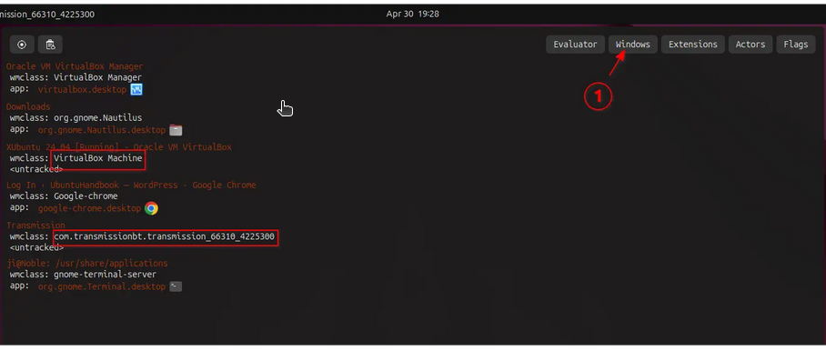

### pip安装慢的问题

#### 方法一（切换源）

常用的国内镜像源：

清华：https://pypi.tuna.tsinghua.edu.cn/simple

阿里云：https://mirrors.aliyun.com/pypi/simple

中国科技大学：https://pypi.mirrors.ustc.edu.cn/simple

```
# 临时使用
pip install <package-name> -i https://pypi.tuna.tsinghua.edu.cn/simple

# 或者永久设置
pip config set global.index-url https://pypi.tuna.tsinghua.edu.cn/simple

```

#### 方法二（增加超时时间）

```
pip install --default-timeout=100 <package-name>
```

#### 方法三（添加代理）

```
# 设置代理
export HTTP_PROXY="http://proxy-server:port"
export HTTPS_PROXY="http://proxy-server:port"
```

#### 方法四（手动下载安装）

```
# 下载包
wget https://files.pythonhosted.org/packages/xxx/xxx/package-name.whl

# 本地安装
pip install ./package-name.whl
```


### ubantu制作应用

在`/usr/share/applications`目录下之执行新建文件

```
vi  图标名称.tesktop

[Desktop Entry]
Type=Application
Name=Navicat//名称
GenericName=Database Development Tool
Icon = /home/ubantu/appImage/icon/navicat.png //图标地址 必填
Exec = /home/ubantu/appImage/navicat17.AppImage //启动命令
Categories=Development;
Keywords=database;sql;
StartupWMClass=AppRun //vmclass

```


`vmclass`获取方式

按 Alt + F2 键启动「运行命令」对话框。您的键盘上应该有一个 F2 功能键。找找看。有时，它们需要以 Fn + 2 的方式运行。我会让您自行解决这个问题。

按 Alt + F2 键会弹出一个对话框。 在此输入 `lg`（小写 LG）：


如图就可以获取到vmclass的属性




